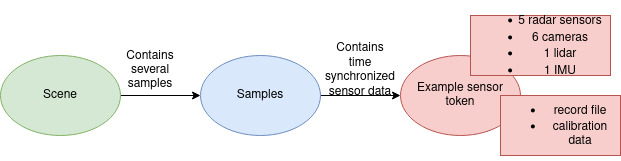
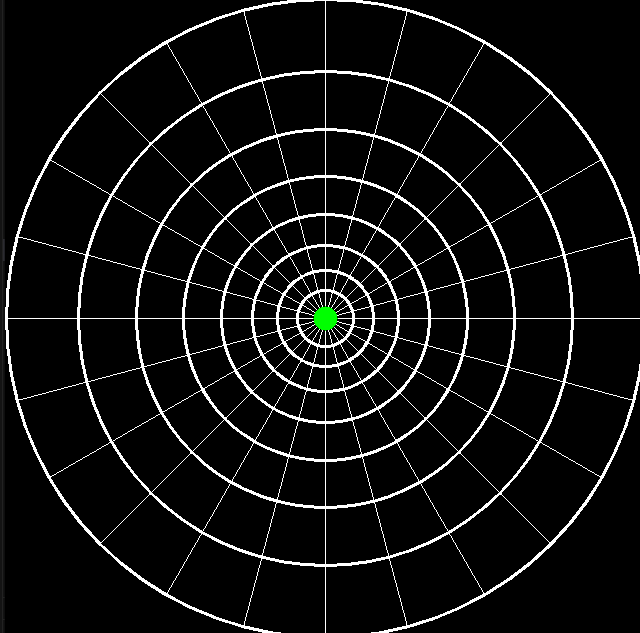

# OccupancyGrid

## Setup

```
sudo apt install python-pip
sudo add-apt-repository ppa:deadsnakes/ppa
sudo apt-get update
sudo apt-get install python3.7
sudo apt-get install python3.7-dev
sudo apt-get install python3.7-venv
```


```
python3.7 -m venv venv
source venv/bin/activate
pip install --upgrade pip
pip install -r requirements.txt
```

## Dataset
The nuScenes dataset is a public large-scale dataset for autonomous driving that contains 1,000 scenes. The full dataset includes approximately 1.4M camera images, 390k LIDAR sweeps, 1.4M RADAR sweeps and 1.4M object bounding boxes in 40k keyframes.



## OccupancyGrid




Critical Points

* Lidar and Radar vary a lot in numbers and in things they detect
* Warping polar maps into carthesian maps is a non trivial task
* Solve overlapping pixels around center - Averaging
* compute the coordinates for circular segments if polar coordinate cell is bigger than one pixel


